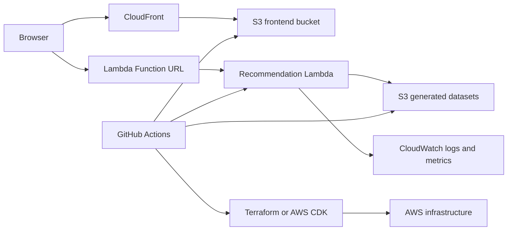

# Aluevaaka Design Document

**Status:** Proposed MVP design  
**Last updated:** 2026-07-30  
**Project type:** AWS-focused portfolio project with a path to commercial location intelligence

## 1. Summary

Aluevaaka is an explainable municipality recommendation platform for Finland. It combines Finnish open datasets with user preferences to recommend municipalities where a person could live, work, or establish a business.

The MVP focuses on relocation within the Helsinki metropolitan area. A user provides preferences such as housing affordability, healthcare access, transport connections, nature, services, and economic outlook. Aluevaaka returns ranked neighbourhoods across Helsinki, Espoo, Vantaa, and Kauniainen, with category scores, explanations, trade-offs, data freshness, and a map-based comparison.

The initial geographic scope is deliberately limited to four cities:

- Helsinki
- Espoo
- Vantaa
- Kauniainen

This is a better MVP boundary than attempting to rank every Finnish municipality. The product can validate whether the recommendation experience is useful before the data model is expanded to other regions.

The MVP is intentionally designed for very low operating cost. It uses static frontend assets and generated datasets where possible, serverless compute for dynamic recommendations, and no continuously running servers or databases.

## 2. Goals

### Product goals

- Provide useful, understandable municipality recommendations.
- Make recommendations explainable rather than presenting an unexplained score.
- Show data sources, collection dates, and limitations.
- Support preference weights and hard constraints.
- Allow users to compare recommended municipalities.
- Provide a credible public demo that can be linked from a CV.
- Establish a foundation for premium reports, municipality services, and B2B location intelligence.

### Engineering goals

- Demonstrate AWS serverless architecture.
- Demonstrate full-stack TypeScript development.
- Demonstrate infrastructure as code and CI/CD.
- Demonstrate automated testing and smoke tests.
- Demonstrate observability and data-quality monitoring.
- Keep idle infrastructure costs close to zero.
- Keep the system simple enough to operate as a solo project.

## 3. Non-goals for the MVP

The following are explicitly deferred:

- Native mobile applications.
- Real-time data ingestion.
- Continuously running workers.
- An always-on relational database.
- Machine-learning-based ranking.
- User accounts and saved searches.
- Payments and subscription management.
- Municipality administration dashboards.
- A general-purpose public API.
- Exact property availability or real-estate listings unless licensing permits their use.

These capabilities can be added after the recommendation workflow and data quality are validated.

## 4. Product scope

### 4.1 MVP user flow

1. The user opens the web application.
2. The application explains the service and its data limitations.
3. The user selects preferences and optional hard constraints.
4. The browser submits the recommendation request to a Lambda Function URL.
5. Lambda loads the current generated dataset from S3.
6. Lambda validates the request and calculates municipality scores.
7. Lambda returns ranked neighbourhoods and score explanations.
8. The frontend displays results on a map, in a ranked list, and in a comparison view.
9. The user can inspect the source and freshness information for each result.

### 4.2 MVP geographic model

The recommendation unit is a neighbourhood or statistical area, not a whole municipality. Every area belongs to one of the four MVP cities and has a stable geographic identifier.

The MVP should use a curated, documented area boundary dataset. It should not infer neighbourhood names from arbitrary map coordinates. Each area record should include:

- Area identifier and display name.
- Parent city: Helsinki, Espoo, Vantaa, or Kauniainen.
- Representative coordinates or polygon geometry.
- Source and publication date.
- Whether the area is a residential area, statistical area, or another defined unit.

If neighbourhood-level data is unavailable for a metric, the product should show the limitation rather than silently presenting municipality-level data as neighbourhood data.

### 4.3 MVP preference categories

The first version should use a limited number of categories with reliable data:

- Housing affordability
- Healthcare and essential services
- Transport and connectivity
- Nature and recreation
- Demographics and economic outlook
- Optional commute or distance constraints

The system should support both:

- **Soft preferences:** factors that influence ranking.
- **Hard constraints:** conditions that exclude a municipality from the result set.

### 4.3 Recommendation result

Each result should include:

- Neighbourhood name and identifier.
- Parent city.
- Overall match score.
- Category-level scores.
- Positive factors.
- Negative factors and trade-offs.
- Applied hard constraints.
- Dataset version and source metadata.
- Confidence or completeness information.
- Map coordinates and basic municipality metadata.

The interface should avoid presenting a score as objective truth. It should describe the result as a match against the user’s selected preferences.

## 5. Architecture overview



### 5.1 Frontend

- React
- Vite
- TypeScript
- React Router if multiple views are needed
- MapLibre GL or Leaflet for maps
- Accessible form controls and responsive layouts
- Static build deployed to S3 and delivered through CloudFront

The frontend is a static application. It does not require a permanently running Node.js server.

### 5.2 Dynamic backend

The MVP exposes one Lambda Function URL:

- `GET /health`
- `POST /recommendations`

The Lambda handler performs path routing internally. This is sufficient for the MVP and avoids adding API Gateway before routing, throttling, authorization, or API management features are needed.

### 5.3 Storage

Amazon S3 stores:

- Static frontend assets.
- Generated municipality datasets.
- Raw or archived source data if needed.
- Deployment metadata.
- Future generated reports.

The frontend bucket should not be treated as a public write location. Deployment credentials should be limited to the CI/CD identity.

### 5.4 Observability

Amazon CloudWatch provides:

- Structured Lambda logs.
- Invocation, error, duration, and throttling metrics.
- Log retention policies.
- Alarms for errors and throttling.
- Optional dashboard for service health.

GitHub Actions smoke tests provide active functionality checks, including when the application has no normal users.

## 6. Why Lambda Function URLs instead of API Gateway

API Gateway is not necessary for the MVP. Lambda Function URLs provide a direct HTTPS endpoint with fewer moving parts and no separate API Gateway request charges.

The initial public endpoint can be:

```text
https://<function-id>.lambda-url.<region>.on.aws/
```

The Function URL should use:

- Public read/execute access only for the recommendation function.
- Strict CORS configuration for the production frontend origin.
- `GET` and `POST` methods only.
- Input validation in Lambda.
- Request-size validation.
- No administrative operations on the public function.
- Structured error responses without internal details.

API Gateway should be introduced when the product needs multiple versioned routes, usage plans, API keys, fine-grained throttling, request validation at the edge, custom API domains, or several backend services behind one API.

## 7. Data architecture

### 7.1 Initial data lifecycle

The MVP uses batch-generated data rather than real-time ingestion. The data refresh is separate from a normal application deployment:

1. A scheduled or manually triggered GitHub Actions workflow downloads selected open datasets.
2. The script validates and normalizes source records.
3. Derived indicators are calculated.
4. Generated JSON files and metadata are produced.
5. The workflow uploads the generated data to the development or production S3 data bucket.
6. The workflow calls the deployed Lambda health endpoint and verifies the new manifest is available.
7. Lambda reads the current dataset from S3 on the next request and refreshes its warm-cache entry when the manifest version changes.

The deployment workflow may generate and upload a dataset as part of a deployment, while `data-pipeline.yml` independently refreshes data weekly or manually. Both workflows must target the same environment bucket. If a source fails, the last validated dataset remains in S3 and the pipeline must not overwrite it with incomplete output.

### 7.2 Suggested generated files

```text
data/generated/
├── municipalities.json
├── housing-costs.json
├── healthcare-access.json
├── transport-connections.json
├── nature-indicators.json
├── economic-indicators.json
├── data-metadata.json
└── dataset-manifest.json
```

The exact sources should be selected based on licensing, availability, update frequency, geographic coverage, and data quality. Every source must be documented.

### 7.3 Data provenance

Each dataset should record:

- Source name and URL.
- License or usage terms.
- Collection timestamp.
- Source publication date, when available.
- Transformation version.
- Geographic identifier used for joins.
- Known missing values and limitations.

The UI should expose relevant provenance information to users. This is both a trust feature and an important engineering demonstration.

### 7.4 Data quality checks

The data pipeline should fail or produce a visible warning when:

- Required columns are missing.
- Municipality identifiers cannot be resolved.
- Coordinates are invalid.
- Numeric values fall outside expected ranges.
- Duplicate municipality records exist.
- A source returns no usable records.
- The generated dataset is unexpectedly much smaller than the previous version.

The pipeline should publish a quality summary with record counts, missing-value counts, and source status.

## 8. Recommendation engine

The initial engine should be deterministic and explainable. Machine learning is not required for the MVP.

For municipality $m$, the weighted score can be represented as:

$$
Score(m) = \sum_{i=1}^{n} w_i \cdot normalizedMetric_i(m)
$$

where $w_i$ is the user’s weight for criterion $i$ and $normalizedMetric_i(m)$ is the normalized municipality metric.

Hard constraints are applied before ranking. For example, a municipality exceeding a maximum commute time is excluded instead of simply receiving a lower score.

Scores should be normalized consistently across the dataset, and the normalization method should be documented. Missing data must not silently become a favorable score. The response should identify incomplete data and reduce confidence where appropriate.

A later implementation may include a confidence adjustment:

$$
AdjustedScore(m) = Score(m) \cdot Confidence(m)
$$

The MVP can initially return confidence metadata without applying a complex adjustment until data coverage is measured.

### 8.1 Explainability

For each recommendation, the backend should return enough intermediate information for the frontend to explain the result:

- Top positive contributors.
- Top negative contributors.
- Category scores.
- Excluded constraints, when relevant.
- Missing or stale data.
- Comparison against the user’s selected baseline, if implemented.

The frontend should not ask an LLM to invent explanations. If natural-language assistance is added later, it should receive verified score details and source metadata from the backend.

## 9. API contract

### 9.1 Health check

`GET /health`

Example response:

```json
{
  "status": "ok",
  "serviceVersion": "1.0.0",
  "datasetVersion": "2026-07-30",
  "datasetStatus": "available"
}
```

The health check should verify that the current dataset can be located and read. It must not be a hardcoded success response.

### 9.2 Recommendation request

`POST /recommendations`

Example request shape:

```json
{
  "preferences": {
    "housingAffordability": 0.25,
    "healthcareAccess": 0.2,
    "transportConnectivity": 0.15,
    "natureAndRecreation": 0.15,
    "economicOutlook": 0.15,
    "services": 0.1
  },
  "constraints": {
    "maximumHousingCost": 1200,
    "maximumDistanceToHealthcareKm": 30
  },
  "limit": 10
}
```

Example response shape:

```json
{
  "datasetVersion": "2026-07-30",
  "results": [
    {
          "neighbourhoodId": "example-area-id",
          "name": "Example neighbourhood",
          "city": "Helsinki",
      "score": 0.82,
      "categoryScores": {
        "housingAffordability": 0.9,
        "healthcareAccess": 0.78,
        "transportConnectivity": 0.74
      },
      "strengths": ["Affordable housing", "Good access to nature"],
      "tradeoffs": ["Smaller local job market"],
      "dataCompleteness": 0.96
    }
  ]
}
```

The request and response should be validated with shared schemas. The API should return appropriate status codes for malformed requests, unavailable datasets, and unexpected internal errors.

## 10. Security and privacy

The MVP does not need user accounts and should avoid storing personal preferences. Requests should be processed without persistence.

Required controls:

- No secrets in frontend assets.
- Least-privilege IAM roles for deployment and Lambda.
- Separate deployment and runtime permissions.
- S3 Block Public Access enabled where possible.
- CloudFront access to frontend assets through the intended origin configuration.
- Strict CORS origins.
- Schema validation for all request bodies.
- Request-size and result-size limits.
- No sensitive preference data in logs.
- Dependency and container scanning in CI where applicable.
- AWS Budgets and billing alerts.

If authentication and saved searches are introduced later, add Cognito and a separate persistence model rather than placing personal data in public S3 objects.

## 11. Cost strategy

The design avoids continuously running infrastructure:

- No EC2 instances.
- No ECS service.
- No RDS or Aurora database in the MVP.
- No NAT Gateway.
- No Kubernetes cluster.
- No continuously running ingestion worker.
- No API Gateway until it provides clear value.

Expected idle costs are limited to storage, log retention, domains if used, and any selected monitoring features. Exact costs depend on AWS region, traffic, retention, and current pricing. The project should include a budget threshold and alerts rather than assuming the free tier is permanent.

Lambda should not be placed in a VPC for the MVP. A VPC Lambda that requires outbound internet access may require a NAT Gateway, which can create a significant cost even with no users.

A cost-conscious deployment may use CloudFront and S3 for the AWS-focused profile. The repository should also document that the frontend could be served from a free static host during development without changing the application architecture.

## 12. Monitoring and operational readiness

### 12.1 Passive monitoring

CloudWatch should capture:

- Invocation count.
- Error count and error rate.
- Duration and p95 duration.
- Throttles.
- Dataset-read failures.
- Validation failures.
- Recommendation result counts.

Use structured JSON events such as:

```json
{
  "event": "recommendation_completed",
  "requestId": "request-id",
  "datasetVersion": "2026-07-30",
  "durationMs": 142,
  "resultCount": 10
}
```

Configure log retention to avoid unbounded storage. Do not log raw user profiles or unnecessary request content.

### 12.2 Active monitoring

A system with no users can still be broken. GitHub Actions should run smoke tests:

- On every deployment.
- After infrastructure changes.
- Optionally once or twice per day.

The smoke test should:

1. Call `/health`.
2. Verify the status and dataset fields.
3. Submit a small valid recommendation request.
4. Validate the response schema.
5. Fail clearly when the endpoint is unavailable or returns invalid data.

CloudWatch Synthetics can be added later if continuous AWS-native monitoring is more important than minimizing recurring cost.

## 13. CI/CD and environments

### 13.1 Pull request checks

- Formatting.
- ESLint.
- TypeScript compilation.
- Unit tests for scoring and normalization.
- API contract tests.
- Data validation tests.
- Terraform or CDK validation.
- Dependency and security checks.

### 13.2 Deployment workflow

A deployment to the main environment should:

1. Build and test the frontend.
2. Build and test the Lambda package.
3. Generate or validate datasets.
4. Validate infrastructure.
5. Apply infrastructure changes using a protected deployment identity.
6. Upload frontend assets and generated data to S3.
7. Deploy the Lambda function.
8. Invalidate CloudFront cached assets if required.
9. Run smoke tests against the Function URL.

### 13.3 Environments

Start with:

- `development`: local or temporary AWS resources.
- `production`: public demo environment.

Add `staging` when changes become frequent or commercial testing begins. Infrastructure state and deployment permissions must be isolated per environment.

## 14. Repository structure

```text
aluevaaka/
├── apps/
│   └── web/
├── services/
│   └── recommendation/
├── packages/
│   ├── scoring/
│   ├── schemas/
│   └── data-model/
├── data/
│   ├── raw/
│   └── generated/
├── scripts/
├── infrastructure/
│   └── terraform/
├── tests/
├── .github/
│   └── workflows/
│       ├── ci.yml
│       ├── deploy.yml
│       └── smoke-test.yml
├── DESIGN.md
└── README.md
```

The shared scoring package should be usable from unit tests and, where practical, from both the frontend and Lambda. This keeps the MVP flexible if some recommendations are later calculated client-side for cost or performance reasons.

## 15. Future commercial direction

The same foundation can support several revenue paths:

### Premium relocation reports

- Detailed personalized report.
- Scenario comparisons.
- Downloadable PDF.
- Optional paid consultation workflow.

### Municipality subscriptions

- Resident-attraction landing pages.
- Anonymous demand and interest analytics.
- Target-group comparisons.
- Data-driven campaign reporting.

### Real-estate and relocation partnerships

- Embeddable recommendation widget.
- Location comparison tools.
- Relocation-company integrations.

### Business location intelligence

- Office and retail site comparisons.
- Workforce and customer demographics.
- Transport accessibility.
- Commercial property analysis.

### API access

An API should only be commercialized after usage patterns and data licensing have been validated. API Gateway, authentication, quotas, and usage plans become more appropriate at that stage.

## 16. Implementation phases

### Phase 1: foundation

- Set up React/Vite application.
- Set up TypeScript packages and shared schemas.
- Define municipality data model.
- Select initial open datasets.
- Implement data normalization and validation.

### Phase 2: recommendation MVP

- Implement weighted scoring.
- Implement hard constraints.
- Build questionnaire.
- Build result list, map, and comparison views.
- Add explanations and data provenance.

### Phase 3: AWS deployment

- Provision S3, CloudFront, Lambda, IAM, and CloudWatch with Terraform or CDK.
- Add Lambda Function URL and CORS.
- Upload generated datasets to S3.
- Deploy static frontend.
- Add CI/CD and smoke tests.

### Phase 4: operational quality

- Add CloudWatch alarms and dashboard.
- Add dataset freshness and quality reports.
- Add budget alerts.
- Add security and dependency scanning.
- Document disaster recovery and rollback procedures.

### Phase 5: product validation

- Add scenario simulation.
- Add historical trends.
- Collect non-sensitive usage analytics with user consent.
- Test premium report demand.
- Interview municipalities and relocation providers.

## 17. Acceptance criteria for the MVP

The MVP is ready for a public portfolio release when:

- A user can submit preferences and receive ranked municipalities.
- Results include score breakdowns and trade-offs.
- The frontend is served through CloudFront from S3.
- The recommendation endpoint runs through a Lambda Function URL.
- Generated datasets are versioned and have documented sources.
- Invalid requests receive safe, useful errors.
- Unit and integration tests cover the scoring engine and API contract.
- CI builds and tests the project automatically.
- Deployment is reproducible through infrastructure as code.
- A smoke test verifies both health and recommendation functionality.
- CloudWatch logs and alarms are configured.
- AWS budget alerts are enabled.
- No always-on compute or database is required.
- The README includes architecture, local setup, deployment, data sources, limitations, and a live demo link.

## 18. Key architectural decisions

| Decision | Rationale |
| --- | --- |
| React/Vite instead of a server-rendered framework | The MVP is primarily a static client application and should minimize operational complexity. |
| S3 and CloudFront for the frontend | Static hosting is inexpensive, scalable, and demonstrates AWS delivery infrastructure. |
| Lambda Function URL instead of API Gateway | One dynamic endpoint is enough for the MVP; direct invocation reduces services and configuration. |
| S3-generated datasets instead of a database | Batch data and read-heavy recommendations do not require an always-on database initially. |
| Deterministic scoring instead of machine learning | Explainability, testing, and data transparency are more valuable than model complexity at MVP stage. |
| GitHub Actions smoke tests | Provides active monitoring while avoiding recurring synthetic-monitoring costs initially. |
| No Lambda VPC | Avoids NAT Gateway costs and unnecessary networking complexity. |
| Infrastructure as code | Makes the AWS environment reproducible and demonstrates DevOps capability. |

## 19. Risks and mitigations

| Risk | Mitigation |
| --- | --- |
| Open data changes format | Version source adapters, validate schemas, and fail visibly. |
| Missing or stale data produces misleading results | Display freshness and completeness, and avoid silently treating missing values as good values. |
| Public endpoint abuse | Validate inputs, cap request sizes, monitor usage, and add throttling or API Gateway later if required. |
| Unexpected AWS costs | Avoid always-on services, enable budgets, set log retention, and review usage regularly. |
| Recommendation appears objective | Explain that scores represent user-weighted matches and expose trade-offs. |
| Data licensing restrictions | Document license terms and do not redistribute restricted data. |
| CloudFront or S3 configuration errors | Provision with IaC and run deployment smoke tests. |
| External source outage | Keep the last validated dataset and expose its age and source status. |

## 20. Conclusion

Aluevaaka’s AWS-focused MVP should be a static React application delivered through S3 and CloudFront, backed by one Lambda Function URL for recommendations and generated datasets stored in S3. CloudWatch, GitHub Actions, and infrastructure as code provide observability and DevOps credibility without requiring continuously running infrastructure.

This architecture is deliberately small. It demonstrates real AWS and full-stack engineering while preserving a clear path to API Gateway, authentication, databases, scheduled ingestion, paid reports, and B2B location intelligence when the product has validated demand.
